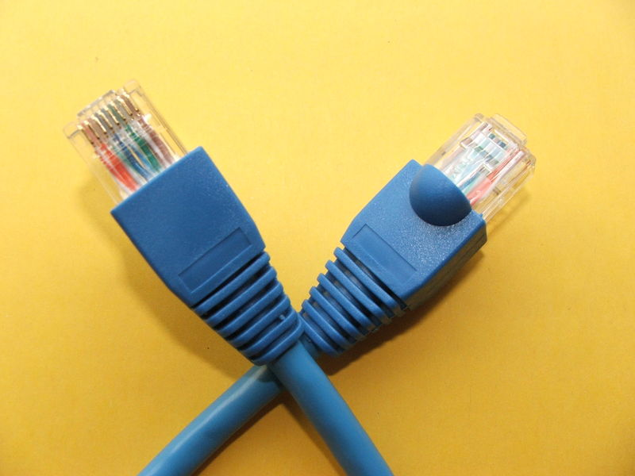

# Rappel sur les bases du réseau

Un réseau informatique permet à des machines connectées entre elles de communiquer et d'échanger des données.

## Types de réseaux

Il existe plusieurs types de réseaux :

- LAN (Local Area Network)
- WAN (Wide Area Network)
- MAN (Metropolitan Area Network)
- Internet

Les LAN sont les plus petits réseaux informatiques qu'il est possible de construire.

Les WAN sont des réseaux qui relient des LAN.

Internet est souvent appelé « le réseau des réseaux ».
En effet, les différents opérateurs qui fournissent un accès à internet (en France Orange, Free, etc) construisent des WAN privés.
Mais il existent encore bien d'autres WAN privés proposés par d'autre opérateurs en France ou à l'étranger.
Internet est le réseau qui relie tout ces WAN.

## Intranets et extranets

Un intranet est un réseau dont les services ne sont accessibles que aux personnes faisant partie de l'organisation qui a mis en place le réseau. (les employés de l'entreprise)

Un extranet est un réseau dont les services sont rendus accessibles aux personnes extérieures à l'organisation qui a mis en place le réseau. (les clients de l'entreprise)

## Modèle OSI (Open Systems Interconnection)

Le modèle OSI est un modèle théorique de communication entre ordinateurs.

La norme OSI, proposée par l'Organisation Internationale de Normalisation (ISO en anglais), n'a pas réussi à s'imposer.
Néanmoins, il est intéressant de connaître le modèle OSI car il permet comprendre l'organisation des protocoles de communication réseau.

| n° | Couche       | Norme                                  |
|----|--------------|----------------------------------------|
| 7  | Application  | Web (DNS / FTP / HTTP...)              |
| 6  | Présentation | HTML / XML / UNICODE                   |
| 5  | Session      | HTTP / HTTPS                           |
| 4  | Transport    | TCP / UDP                              |
| 3  | Réseau       | IPv4 / IPv6 / OSPF / RIP               |
| 2  | Liaison      | Ethernet / xDSL / WIFI / LACp          |
| 1  | Physique     | RJ45 / RJ11 / RJ12. Câbles Cat. 5 et + |

Pour plus de détails, voir [Modèle OSI — Wikipédia](https://fr.wikipedia.org/wiki/Mod%C3%A8le_OSI).

Les unités de données sont également nommées Protocol Data Unit.

Si on doit faire un rapport simplifié entre les couches et les équipements réseaux, alors :
  La couche 1 sera utilisée par des HUB
  La couche 2 sera utilisée par des switchs (utilisable aussi sur la couche 3)
  La couche 3 sera utilisée par des routeurs

## Connexion au sein d'un réseau

### Câble

Les types de câbles les plus connus sont les câbles Ethernet, et les fibres optiques. Chacun des deux à ses avantages et ses inconvénients.

#### Câble Ethernet

Pour des raisons d'efficacité de transmission du signal, on utilise des câbles composés de fil de cuivre en paires torsadées. Pas cher, assez solide, et apportant une faible atténuation du signal sur la distance.

Un câble de quatre paires torsadées :

Les terminaisons de ces paires s'appellent des brins, il y en a donc huit (quatre paires).
Pour améliorer la qualité de transmission du signal, les câbles sont « blindés » contre les champs électromagnétiques. Le blindage va également offrir une protection sommaire face aux rongeurs, et lutter contre une usure du câble par une utilisation inapropriée.
Plus ce blindage est important, plus la qualité du signal est meilleure.
Les câbles sont classés en catégorie en fonction de la qualité du blindage.

Pour des réseaux informatiques relativement simples, les catégories suivantes sont suffisantes :

- la catégorie 5 (CAT5) est maintenant obsolète mais elle peut être utilisée dans le cadre de réseaux domestiques de petite taille ; cette catégorie a une bande passante de 100 MHz et un débit de 100 Mbit/s
- la catégorie 5 enhanced (CAT5e) est utilisée dans le cadre de réseaux professionnels ; cette catégorie a une bande passante de 100 MHz et un débit de 1 000 Mbit/s
- la catégorie 6 (CAT6) est aussi utilisé dans le cadre de réseaux professionnels ; son avantage par rapport au cat5e est de présenter une résistance plus faible et donc d'être plus économe en énergie lorsqu'on utilise du PoE (Power over Ethernet) ; cette catégorie a une bande passante de 250 MHz et un débit de 10 000 Mbit/s

### PoE (Power over Ethernet)

Ce système permet d'alimenter une machine connectée au réseau en utilisant les câbles réseau au lieu de mettre en place un réseau électrique en plus.

La norme permet de pouvoir faire passer 48 V.

Attention donc lors de la manipulation de ces câbles et veillez à bien les protéger et les isoler pour éviter tout court-circuit.

### Connecteurs

Il existe plusieurs types de connecteurs selon le nombres de paires du câble, et de l'usage désiré.
La plupart du temps, ce sont des connecteurs de type RJ45 qui sont utilisés.

Un connecteur RJ45 :

Selon l'ordre des brins dans le connecteur, le câble peut être droit ou croisé. Entre deux équipements réseaux identiques (deux switchs par exemple), il faudra utiliser un câble croisé afin qu'ils puissent communiquer ensemble.

D'autres connecteurs existent, tel que le RJ11 (téléphone à 4 brins), RJ12 (téléphone à 6 brins) etc.

Relier un câble et un connecteur est appelé « sertir un câble ».
Il existe des pinces permettant d'effectuer cette opération de façon simplifiées.
Il existe également des appareils pour vérifier individuellement la bonne connectivité de chaque brin du câble, utilisé pour vérifier la qualité du câble.

Les brins du câble doivent être reliés dans un ordre précis pour que la communication réseau fonctionne, selon des normes imposées.
Il y a des codes couleurs qui permettent de s'y retrouver plus facilement.

Conseil : les prises RJ45 ont été conçues pour être compatibles avec les prise RJ11. Du coup il est possible de brancher un téléphone sur une prise RJ45 et d'utiliser le câble comme ralllonge téléphonique.
Autrement dit, lors de la conception du réseau téléphonique, plutôt que de déployer des câbles avec des connecteurs RJ11, il vaut mieux déployer des câbles avec des connecteurs RJ45 qui peuvent être utilisé indiféremment pour le téléphone ou l'informatique.
Le coût de la main d'œuvre du déploiement est le même, seul le prix des câbles et des connecteurs varie un peu.Mais l'installation sera beaucoup plus modulable dans le futur.

#### Fibre optique

C'est un type câble dont le fil est composé de verre ou de plastique.
Cette matière transparente permet de faire passer de la lumière.
C'est donc la lumière qui transporte l'information à la place des impulsions électriques comme dans un câble en cuivre.

La fibre optique possède des particularités qui en font un excellent choix pour déployer un réseau informatique :

- un très haut débit par rapport aux câbles de cuivre
- une atténuation du signal beaucoup moins forte que celle des câbles de cuivre
- une insensibilité aux interférences électromagnétiques

Mais son inconvénient majeur est son prix.
Les câbles à fibre optique et le matériel qui est capable d'en tirer profit sont plus chers que les câbles en cuivre et le matériel associé.
Autre inconvénient rencontré à l'armée en opérations, lors d'installations sommaires, elle est souvent endommagée par les utilisateurs.

On trouve 
Il existe plusieurs types de connecteurs, selon le type d'équipement utilisé, entre autres.

Il existe également différents types de fibre optique. La différence et la méthode de transmission de la lumière dans le câble, et va changer la spécificité du câble.
On retrouvera :

|             Fibre             | Affaiblissement du signal | Portée     | Débit      | Taille du coeur |
|-------------------------------|---------------------------|------------|------------|-----------------|
|           Monomode            |            0,5 dB/KM      | +/- 100 km | 100 Gbit/s |   - 10 μm       |
| Multimode à gradient d'indice |             10 dB/KM      | +/- 2 km   | 1 Gbit/s   |   50-100 μm     |
| Multimode à saut d'indice     |             10 dB/KM      | +/- 2 km   | 100 Mbit/s |   200 μm        |

- Le monomode : elle offre le meilleur rapport pour le moment. Envoi de la lumière en ligne droite.
- Le multimode à gradient d'indice : utilisé dans les réseaux locaux. Les rayons lumineux ont une forme elliptiques lors de leurs propagations.
- Le multimode à saut d'indice : utilisé dans les réseaux locaux. Les rayons lumineux se propagent par réflexion en dent de scie

## Equipements réseau

### HUB

Appelé aussi répéteur.
Permet de connecter plusieurs machines entre elles afin de créer un réseau. Matériel obselete. Traite sur la couche 1 (physique).
Matériel très limité dans son utilisation.
Régénère les signaux qu'il traite, partage la bande passante, et s'adapte au réseau le plus faible.

### Switch

Egalement appelé commutateur.

A la différence du hub, en se servant de l'adresse IP et de l'adresse MAC, le switch est capable de savoir sur quel port chaque machine est connectée.
Quand une machine transmet un signal, le switch achemine le signal vers le port de destination seulement au lieu de le diffuser (braodcast) sur tous les ports comme le hub.
Le switch créé plusieurs segments de réseau qui sont donc isolés entre eux.
Ceci a pour effet de réduire le risque de collision. Il va travailler sur la couche 2 (liaison), et il est configurable pour travailler sur la couche 3 (Réseau).

Il existe une version plus limité qui est le brdige. Il permet de connecter deux réseaux entre eux, même si ils utilisent des technologies différentes. Il va séparer les domaines de collision.

### Routeur

### Wireless access point (point d'accès sans fil)

### CPL

#### Différence IS / ES
 End System (système terminal) est un équipement que se retrouve connecté sur la péréphérie du réseau (ordinateur, imprimante, téléphone)
 Intermédiate system est un équipement qui va servir de lien, de jonction entre deux ou plusieurs équipements au sein du réseau.

## Adressage IP
### Adresse IP
### Subnetting (découpage)

TODO : 

