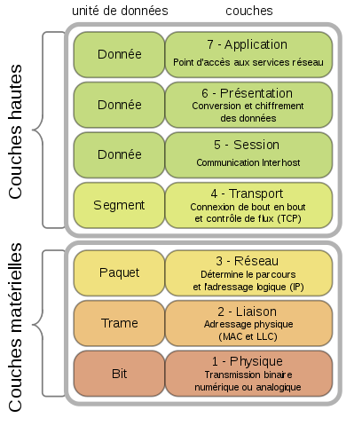

# Rappel sur les bases du réseau

Un réseau informatique permet à des machines connectées entre elles de communiquer et d'échanger des données.

## Types de réseaux

Il existe plusieurs types de réseaux :

- LAN (Local Area Network)
- WAN (Wide Area Network)
- MAN (Metropolitan Area Network)
- Internet

Les LAN sont les plus petits réseaux informatiques qu'il est possible de construire.

Les WAN sont des réseaux qui relient des LAN.

Internet est souvent appelé « le réseau des réseaux ».
En effet, les différents opérateurs qui fournissent un accès à internet (en France Orange, Free, etc) construisent des WAN privés.
Mais il existent encore bien d'autres WAN privés proposés par d'autre opérateurs en France ou à l'étranger.
Internet est le réseau qui relie tout ces WAN.

## Intranets et extranets

Un intranet est un réseau dont les services ne sont accessibles que aux personnes faisant partie de l'organisation qui a mis en place le réseau. (les employés de l'entreprise)

Un extranet est un réseau dont les services sont rendus accessibles aux personnes extérieures à l'organisation qui a mis en place le réseau. (les clients de l'entreprise)

## Modèle OSI (Open Systems Interconnection)

Le modèle OSI est un modèle théorique de communication entre ordinateurs.

La norme OSI, proposée par l'Organisation Internationale de Normalisation (ISO en anglais), n'a pas réussi à s'imposer.
Néanmoins, il est intéressant de connaître le modèle OSI car il permet comprendre l'organisation des protocoles de communication réseau.

| n° | Couche       | Norme                                  |
|----|--------------|----------------------------------------|
| 7  | Application  | Web (DNS / FTP / HTTP...)              |
| 6  | Présentation | HTML / XML / UNICODE                   |
| 5  | Session      | HTTP / HTTPS                           |
| 4  | Transport    | TCP / UDP                              |
| 3  | Réseau       | IPv4 / IPv6 / OSPF / RIP               |
| 2  | Liaison      | Ethernet / xDSL / WIFI / LACp          |
| 1  | Physique     | RJ45 / RJ11 / RJ12. Câbles Cat. 5 et + |

Pour plus de détails, voir [Modèle OSI — Wikipédia](https://fr.wikipedia.org/wiki/Mod%C3%A8le_OSI).

Les unités de données sont également nommées Protocol Data Unit.

Si on doit faire un rapport simplifié entre les couches et les équipements réseaux, alors :
  La couche 1 sera utilisée par des HUB
  La couche 2 sera utilisée par des switchs (utilisable aussi sur la couche 3)
  La couche 3 sera utilisée par des routeurs

TODO : 
Difference RJ11 / 12
Catégories de cables
ETC
